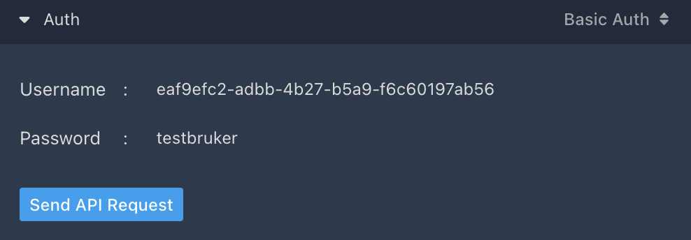

# wannabe5-core

Wannabe5 Core - under development

### Development user

After running the seed a User 'testbruker' with the id `eaf9efc2-adbb-4b27-b5a9-f6c60197ab56` is created and a AccessToken with the token `testbruker`  
This can be used in `/docs/api` to test api endpoints



### Getting started with Local development

Basic development setup requires 3 things
1. Basic configuration (done via `.env` file)
2. Running Laravel (the app) and Postgres (the database) containers
3. Properly "initialised" Laravel app (mainly via Laravel CLI commands)
4. Opening app to validate that it works

> [!WARNING]
> Repeat these steps as often as needed. Things can and will change, especially during early project development.

#### 1. Basic configuration

Use our recommended defaults by using the included example .env file. Copy `.env.example` to `.env`

```bash
cp .env.example .env
```

#### 2. Start Laravel and Posgres containers

We use docker to run Laravel and Postgres in a stable and predictable way. If you have docker installed it should be as simple as

```bash
docker compose up
```

> [!TIP]
> `up` command by default starts container in a live mode so that you can see their output, and easily stop them by Ctrl/Cmd-c. Use `-d` (detach) flag to instead run them in the background and use the `logs` and `stop` commands to see output and stop them.

#### 3. Initialise Laravel app

If visiting application on port `8000` now you will probably see errors, this is due to Laravel missing default data.

In a new terminal window run the following commands (in order)

```bash
# This opens up a bash shell inside the container
docker compose exec app bash
# Allowing us to run these commands inside the container
php artisan key:generate
php artisan migrate:fresh --seed
```

> [!TIP]
> There are multiple ways to run commands inside these containers. The `exec <app name> bash` method is good if you want to do multiple commands, but for one off commands you can call `php artisan` directly, for example `docker compose exec app php artisan key:generate`

> [!IMPORTANT]
> The Laravel container install dependencies automatically on startup via `composer install` (not to be confused with `docker compose`). If you ever need to adjust these without restarting or rebuilding container, just run `docker compose exec app composer install` (or equivalent)

#### 4. Validating that app is working

After completing the final command above, the API should be available to you at `localhost:8000`.

You should check out [OpenAPI documentation](http://localhost:8000/docs/api), and make sure [Default API route](http://localhost:8000/api) shows the expected debug information

### Using Visual Studio-Code Dev-Containers

Dev-containers ([requirements and setup-guide](https://code.visualstudio.com/docs/devcontainers/containers#_installation)) is a simplified, but a bit more complex, development alternative for Visual Studio Code users

The underlying requirements are the same as getting started setup, but in addition VSCode uses the `devcontainer` container to load and run VSCode itself with a predictable configuration.

First, set-up the env variables (identical to step 1 in regular setup)

```bash
cp .env.example .env
```

After the database is up and running, you can start the dev-container from your VS Code interface.

Start VS Code, run the Dev Containers: Open Folder in Container... command from the Command Palette. For more information, see [here](https://code.visualstudio.com/docs/devcontainers/containers#_quick-start-open-an-existing-folder-in-a-container).

After the dev-container is running, you need to initialise the Laravel app (commands identical to step 3, but run via VSCode container terminal)

```bash
php artisan key:generate
php artisan migrate:fresh --seed
```

Now check out step 4 from the regular guide to validate that app is working as expected
